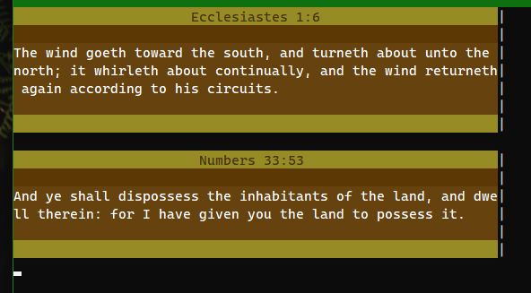

# Drop - Random Bible Verses

This program just prints out random verses from the KJV Bible in the commandline.



## Usage
Upon opening, the user is greeted with a random verse. Hitting ```Enter``` brings up new verses. Exiting is done through first hitting ```Space``` and then ```Enter```.\
**Note:** To understand what the verse actually means, you need to know the context. (duh!)

## Build
**Requirements:** [GCC](https://gcc.gnu.org/) or [Clang](https://clang.llvm.org/) (or any other C compiler)

### Building on Windows:
GCC: ```gcc -o Drop.exe *.c```\
Clang:```clang -o Drop.exe *.c```

### Building on Linux:
GCC: ```gcc -o Drop *.c```\
Clang:```clang -o Drop *.c```

### Note
If you don't have any standalone compilers installed, but have Microsoft Visual Studio, you can copy-paste the sourcefiles into a new C/C++ project and compile them that way.

## License
This software is under the MIT License.
