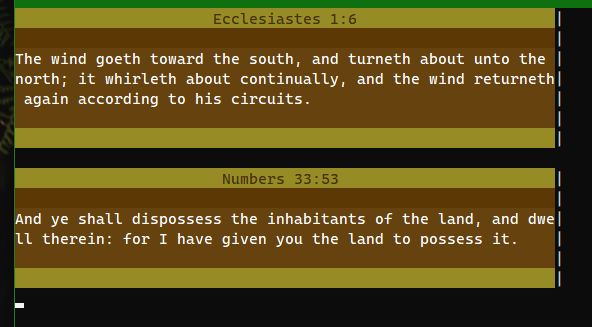
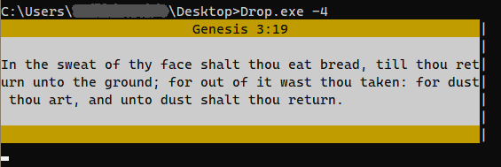

# Drop - Random Bible Verses

This program just prints out random verses from the KJV Bible in the commandline.

It supports 2 color modes. The default is RGB, since every computer with a graphical interface supports RGB, even in the commandline. However, if your computer does not have any GUI installed, it cannot display RGB colors. For this, it has something called 4-bit mode, meaning it uses 4-bit colors.

**RGB Mode**\


**4-Bit Mode**\


## Usage
Upon opening, the user is greeted with a random verse. Hitting ```Enter``` brings up new verses. Exiting is done through first hitting ```Space``` and then ```Enter```.\
To activate 4-bit colors, use the program with the ```-4``` keyword (see the picture above).\
**Note:** To understand what the verse actually means, **you need to know the context around it!** (duh!)

## Build
**Requirements:** [GCC](https://gcc.gnu.org/) or [Clang](https://clang.llvm.org/) (or any other C compiler)

### Building on Windows:
GCC: ```gcc -o Drop.exe src/*.c```\
Clang:```clang -o Drop.exe src/*.c```

### Building on Linux:
GCC: ```gcc -o Drop src/*.c```\
Clang:```clang -o Drop src/*.c```

### Note
If you don't have any standalone compilers installed, but have Microsoft Visual Studio, you can copy-paste the sourcefiles into a new C/C++ project and execute it that way.

## License
This software is licensed under MIT.
